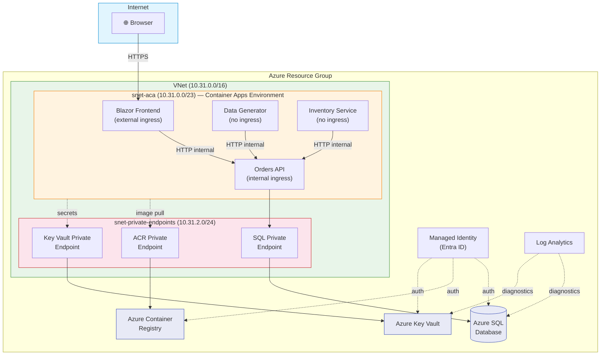

# Miyazaki Retail — Azure Container Apps Data Generator

> **Disclaimer:** This repository is provided as-is for learning purposes and is not actively maintained. Dependencies, Azure services, and APIs may change over time. Use at your own discretion.

A hands-on lab for building and deploying a multi-service retail application on **Azure Container Apps**, with a fully private, production-grade architecture.

## Architecture



## Services

| Service | Type | Description |
|---------|------|-------------|
| **Orders API** | ASP.NET Core Web API | CRUD for customers, products, and orders. EF Core → Azure SQL. |
| **Frontend** | Blazor Server | Retail dashboard UI — orders, products, customers, inventory. |
| **Data Generator** | .NET Worker Service | Generates fake data with Bogus and posts to the Orders API. |
| **Inventory Service** | .NET Worker Service | Polls for new orders and tracks stock levels per product. |

## Security

- **Frontend** has external ingress on Azure Container Apps — all other services use internal-only ingress
- **Private endpoints** for Azure SQL, ACR, and Key Vault (all traffic on Azure backbone)
- **Managed Identity (Entra ID)** for SQL auth, ACR pull, and Key Vault access — no stored passwords

## Project Structure

```
├── src/
│   ├── OrdersApi/          # ASP.NET Core Web API
│   ├── Frontend/           # Blazor Server app
│   ├── DataGenerator/      # .NET Worker Service
│   └── InventoryService/   # .NET Worker Service
├── infra/                  # Bicep modules for Azure infrastructure
├── .github/
│   └── workflows/          # CI/CD pipelines
├── docker-compose.yml      # Local development
├── plan.md                 # Lab plan and design decisions
├── instructions.md         # Step-by-step lab instructions
└── README.md
```

## Prerequisites

- [.NET SDK](https://dotnet.microsoft.com/download)
- [Docker Desktop](https://www.docker.com/products/docker-desktop)
- [Azure CLI](https://learn.microsoft.com/cli/azure/install-azure-cli)
- An Azure subscription
- (Optional) [Microsoft Fabric](https://www.microsoft.com/microsoft-fabric) capacity for Power BI reporting

## Getting Started

### Local Development

1. Clone the repo
2. Copy the environment template and set your SQL password:
   ```bash
   cp .env.example .env
   ```
3. Start all services:
   ```bash
   docker-compose up --build
   ```
4. Open `http://localhost:8080` in your browser

### Azure Deployment

1. Update `infra/main.bicepparam` with your desired Azure region and base name
2. Configure the following GitHub repository **secrets** for CI/CD:
   - `AZURE_CLIENT_ID` — Service principal / federated credential client ID
   - `AZURE_TENANT_ID` — Entra ID tenant ID
   - `AZURE_SUBSCRIPTION_ID` — Azure subscription ID
3. Configure the following GitHub repository **variables**:
   - `AZURE_RESOURCE_GROUP` — Target resource group name
   - `ACR_NAME` — Azure Container Registry name (without `.azurecr.io`)

Follow the [Lab Instructions](instructions.md) for the full step-by-step walkthrough.

## License

See [LICENSE](LICENSE) for details.